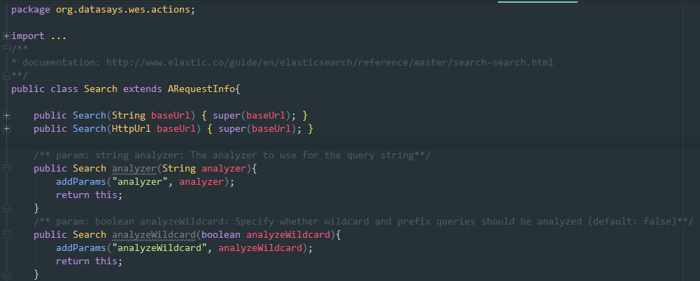
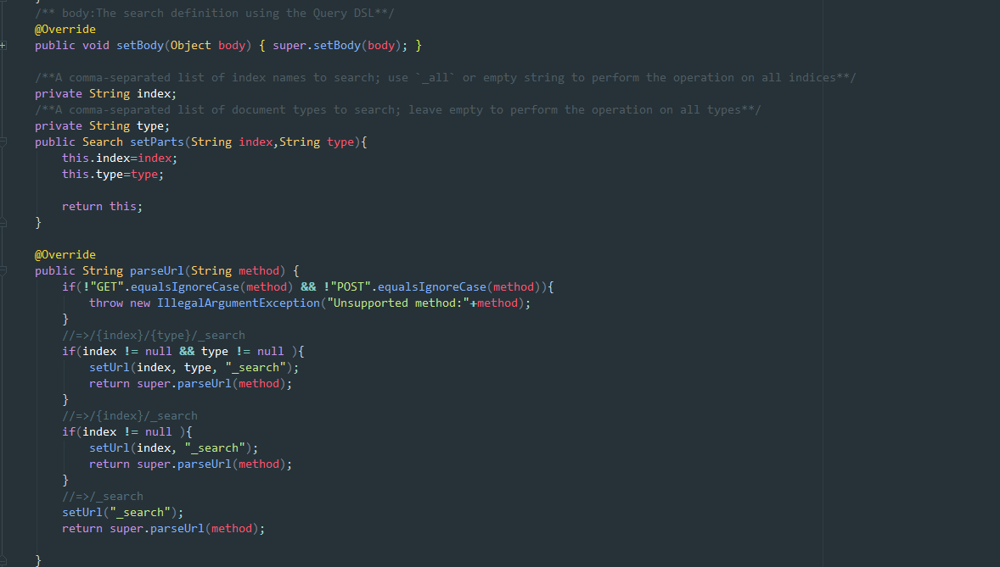

# wES-client 用户手册

1. [概述](#TOC-Overview)
2. [wES-client目标](#TOC-Goals-for-wES-client)
3. [wES-client性能及可扩展性](#TOC-wES-client-Performance-and-Scalability)
4. [使用wES-client](#TOC-Using-wES-client)
    * [通过Maven使用wES-client](#TOC-wES-client-With-Maven)
    * [通过Gradle使用wES-client](#TOC-wES-client-With-Gradle)
5. [wES-client核心类](#TOC-core-classes)
    * [org.datasays.wes.core.BaseEsHelper](#TOC-BaseEsHelper)
    * [org.datasays.wes.core.IConvert](#TOC-IConvert)
    * [org.datasays.wes.client.EsService](#TOC-EsService)
6. [代码生成器](#TOC-codegen)
    * [org.datasays.wes.toolkit.codegen.EsRestSpecGen](#TOC-EsRestSpecGen)
    * [org.datasays.wes.toolkit.codegen.EsRestSpecGen4Retrofit](#TOC-EsRestSpecGen4Retrofit)

## <a name="TOC-Overview"></a>概述
一个基于Retrofit2/OkHttp的Java客户端, 她是基于官方的[ElasticSearch Rest API规范](https://github.com/elastic/elasticsearch/tree/master/rest-api-spec)生成的. 她包含两种访问ElasticSearch的实现: OkHttp3版本的和Retrofit2版本. 而且她只依赖okhttp3/retrofit2,并且可以通过实现**org.datasays.wes.core.IConvert**接口支持任意一种Java Json类库. 你可以按照你的想法使用她.

## <a name="TOC-Goals-for-wES-client"></a>wES-client目标

* 基于官方的[ElasticSearch Rest API规范](https://github.com/elastic/elasticsearch/tree/master/rest-api-spec)生成核心代码,保证支持最近版本的ES
* 使用Retrofit2/OkHttp作为http访问层,保证可扩展性及易用性,并且关联ES官方API文档
* 使用IConvert抽象Json序列化,可定制支持多种Json序列化类库.例如:[Gson](https://github.com/google/gson/), [jackson](https://github.com/FasterXML/jackson), [fastjson](https://github.com/alibaba/fastjson)
* 最小类库依赖,尽可能简单

## <a name="TOC-wES-client-Performance-and-Scalability"></a>wES-client性能及可扩展性
[wES-benchmark](https://github.com/DataSays/wES/blob/master/docs/Benchmark_zh.md): 一份针对以下java ElasticSearch客户端的性能测试报告. 支持以下API对比:
  + [wES-client](https://github.com/DataSays/wES)[已完成]
  + [Jest](https://github.com/searchbox-io/Jest)[已完成]
  + [elastic Java API 5.0](https://www.elastic.co/guide/en/elasticsearch/client/java-api/current/index.html)
  + [elastic Java REST Client 5.0](https://www.elastic.co/guide/en/elasticsearch/client/java-rest/current/index.html)

## <a name="TOC-Using-wES-client"></a>使用wES-client
wES-client使用gradle构建为一个jar工程,所以可以支持Maven和Gradle项目使用,也可以下载jar后直接加入classpath使用.

### <a name="TOC-Gson-With-Maven"></a>通过Maven使用wES-client
在你的pom.xml文件中的dependencies部分增加wES-client类库依赖:
```xml
    <dependency>
      <groupId>org.datasays</groupId>
      <artifactId>wES-client</artifactId>
      <version>1.0</version>
      <scope>compile</scope>
    </dependency>
```

### <a name="TOC-Gson-With-Gradle"></a>通过Gradle使用wES-client
在你的build.gradle文件中的dependencies部分增加wES-client类库依赖:
```groovy
  compile 'org.datasays:wES-client:1.0'
```

## <a name="TOC-core-classes"></a>wES-client核心类

### <a name="TOC-BaseEsHelper"></a>org.datasays.wes.core.BaseEsHelper
The okhttp3 like API to visit the ElasticSearch. It support all ElasticSearch API `org.datasays.wes.actions` and Enum types `org.datasays.wes.types`. You can use URL ways or send GET/POST/PUT/HEAD/DELETE request with a Json request body. The source code include all comments like this:



### <a name="TOC-IConvert"></a>org.datasays.wes.core.IConvert
A Java interface for JSON serializer and parser.

### <a name="TOC-EsService"></a>org.datasays.wes.client.EsService
The retrofit2 like API to visit the ElasticSearch. It only support to convert Json response to Object and can't pass the params on URL. So it can't used on complex scene. we will fix it with a better implement ASAP.

## <a name="TOC-codegen"></a>代码生成器
### <a name="TOC-EsRestSpecGen"></a>org.datasays.wes.toolkit.codegen.EsRestSpecGen
It's the CodeGen java program for the okhttp3 like API. It will gen all codes on package 'org.datasays.wes.actions' and 'org.datasays.wes.types'. The code is will simple, you can modify it as your way. You also can get another ES Rest API version from https://github.com/elastic/elasticsearch/tree/master/rest-api-spec by other Git branch versions, copy them to override all **/wES-toolkit/api/** json files and re-Gen the codes. You can run it as a normal Java program or run it by shell command on wES-toolkit path:
```shell
    gradle EsRestSpecGen
```

### <a name="TOC-EsRestSpecGen4Retrofit"></a>org.datasays.wes.toolkit.codegen.EsRestSpecGen4Retrofit
It's like the EsRestSpecGen, but it's for The retrofit2 like API **EsService**.
